# Infrastruttura Active Directory e Mail Server LALILULELO
**Enrico Petrillo 902855**

## 1. Approccio 
Il progetto scelto è la realizzazione di un'infrastruttura di dominio Active Directory (Samba) per una piccola organizzazione composta da 5 client (computer), 10 utenti interattivi e 10 caselle di posta elettronica da 5 GB (totale 50 GB di storage dedicato alla posta).

Piuttosto che eseguire decine di comandi manuali all'interno della macchina server, **la logica di configurazione è stata codificata all'interno di script, Dockerfile, docker-compose.yml e file di configurazione**. 

Questo approccio permette di definire, avviare e distruggere l'intera infrastruttura (Domain Controller, Web UI, Mail Server e Webmail) con un solo comando.

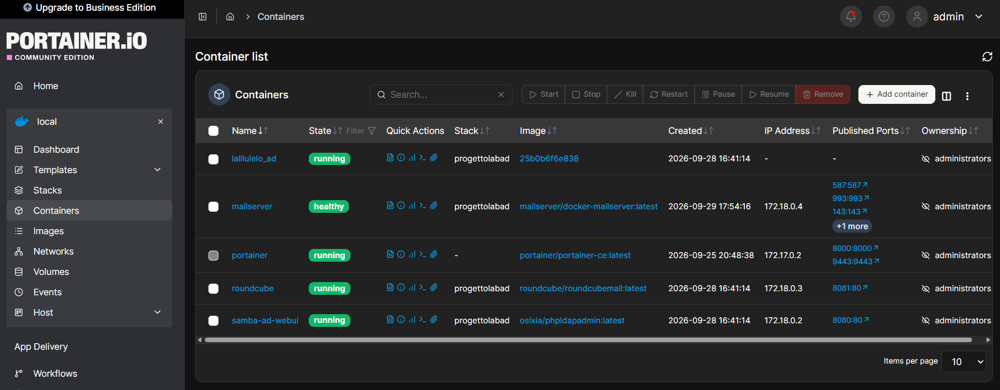

## 2. Installazione VM e Preparazione Host

In questa fase, è stata preparata la macchina virtuale host che ospiterà i container. Il sistema operativo scelto è **XUbuntu** perché più leggero rispetto ad altre distribuzioni.
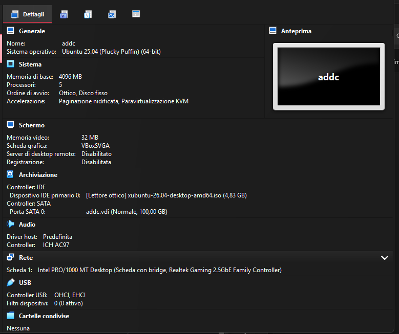

### 2.1 Creazione VM e Partizionamento
La macchina virtuale è stata configurata con un disco da 100 GB. Durante l'installazione del sistema operativo, è stato scelto un partizionamento manuale. 
Dato il massiccio utilizzo di container e la necessità di dedicare 50 GB per le e-mail, lo schema di partizionamento applicato è il seguente:
- **`/` (Root)**: 40 GB
- **`/var/lib/docker`**: 60 GB (Questo volume separato garantisce che i dati dei container e le caselle di posta non saturino mai la partizione di sistema).


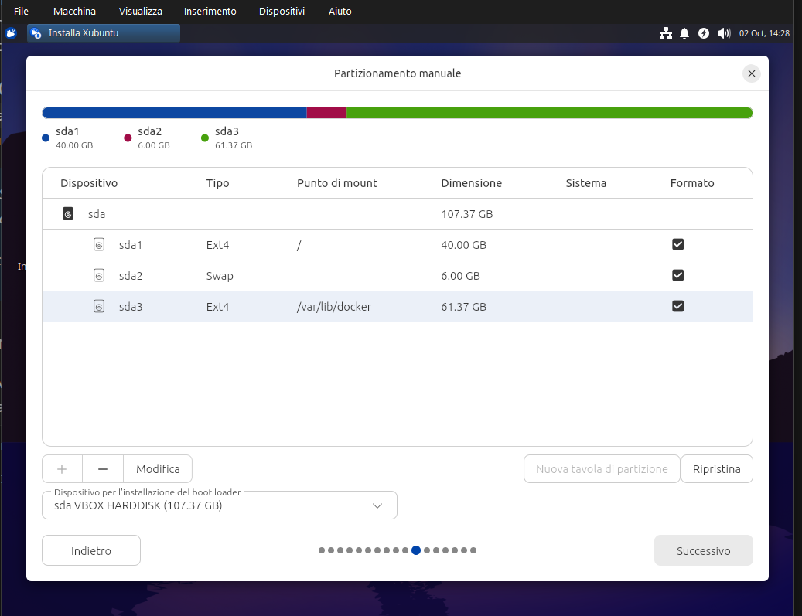

### 2.2 Configurazione di Rete e Risoluzione Conflitti DNS
Samba AD richiede l'uso esclusivo della porta 53 per il proprio server DNS. Su Ubuntu, questa porta è solitamente occupata dal servizio `systemd-resolved`.
È stato quindi necessario disabilitare il listener stub:

```bash
# Modifica del file di configurazione
sudo nano /etc/systemd/resolved.conf 
# Sostituire "#DNSStubListener=yes" con "DNSStubListener=no"

# Riavvio del servizio per applicare la modifica
sudo systemctl restart systemd-resolved

# Ripristino del file resolv.conf per usare un DNS esterno
sudo rm /etc/resolv.conf
sudo ln -s /run/systemd/resolve/resolv.conf /etc/resolv.conf
```

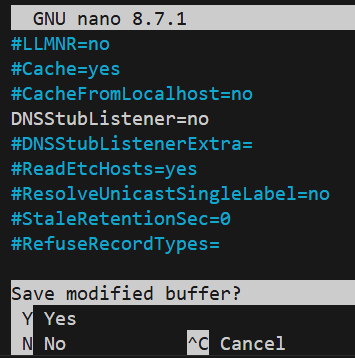
### 2.3 Configurazione del Firewall
Per consentire il traffico verso Active Directory e il Mail Server, sono state aperte le porte necessarie nel firewall dell'host:

```bash
sudo ufw allow 53
sudo ufw allow 88
sudo ufw allow 135
sudo ufw allow 137:139/tcp
sudo ufw allow 137:139/udp
sudo ufw allow 389
sudo ufw allow 445
sudo ufw allow 464
sudo ufw allow 636
sudo ufw allow 3268
sudo ufw allow 3269
sudo ufw allow ssh
sudo ufw enable

```


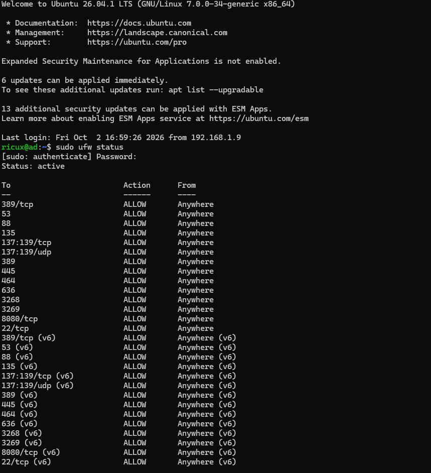

### 2.4 Installazione di Docker e Portainer
Per l'installazione si è utilizzato il repository ufficiale Ubuntu:

```bash
# Aggiornamento pacchetti base
sudo apt update && sudo apt upgrade -y

# Aggiunta della chiave GPG ufficiale di Docker
sudo install -m 0755 -d /etc/apt/keyrings
sudo curl -fsSL https://download.docker.com/linux/ubuntu/gpg -o /etc/apt/keyrings/docker.asc
sudo chmod a+r /etc/apt/keyrings/docker.asc

# Aggiunta del repository
# dpkg --print-architecture  permette di conoscere l'architettura della macchina (amd64, arm64, etc.)
# $(. /etc/os-release && echo "$VERSION_CODENAME")  permette di conoscere il nome in codice della versione di ubuntu (es. noble, jammy, etc.) 
echo \
  "deb [arch=$(dpkg --print-architecture) signed-by=/etc/apt/keyrings/docker.asc] https://download.docker.com/linux/ubuntu \
  $(. /etc/os-release && echo "$VERSION_CODENAME") stable" | \
  sudo tee /etc/apt/sources.list.d/docker.list > /dev/null

# mette la riga
# deb [arch=amd64 signed-by=/etc/apt/keyrings/docker.asc] https://download.docker.com/linux/ubuntu   resolute stable
# nel file  /etc/apt/sources.list.d/docker.list sul mio host 

# Installazione dei pacchetti Docker
sudo apt update
sudo apt install docker-ce docker-ce-cli containerd.io docker-buildx-plugin docker-compose-plugin

# Verifica installazione
sudo docker run hello-world
```

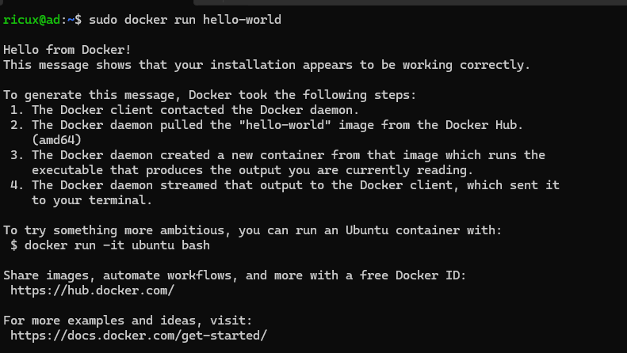

Inoltre, per avere un'interfaccia grafica di gestione dei container, è stato installato **Portainer**:
```bash
sudo docker volume create portainer_data
sudo docker run -d -p 8000:8000 -p 9443:9443 --name portainer --restart=always \
  -v /var/run/docker.sock:/var/run/docker.sock -v portainer_data:/data portainer/portainer-ce:latest
```
per poter usare portainer è stato necesasrio accedere a all'indirizzo: https://localhost:9443  per configurare la password. La schermata di creazione ha richiesto l'inserimento di un token ottenuto eseguendo il comando:

```bash
sudo docker logs -f portainer
```
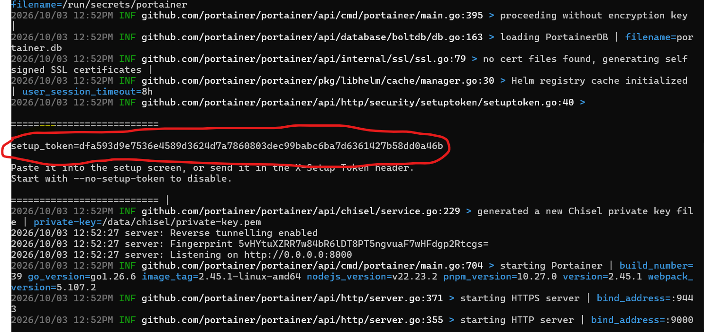

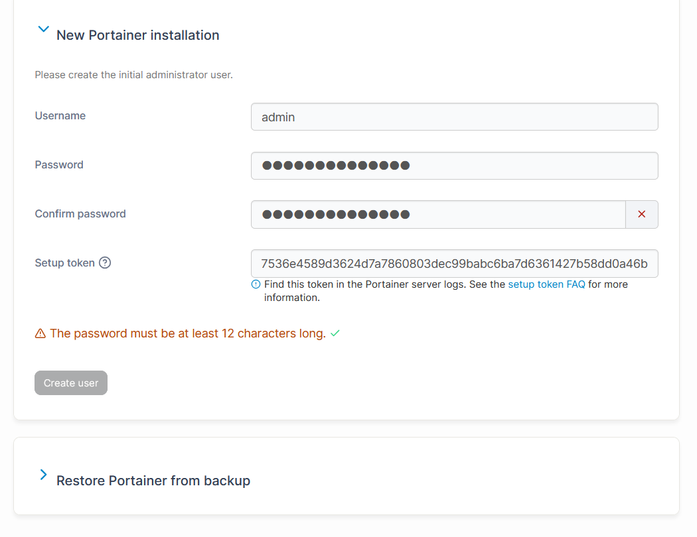

alla fine questa è stata la schermata di login

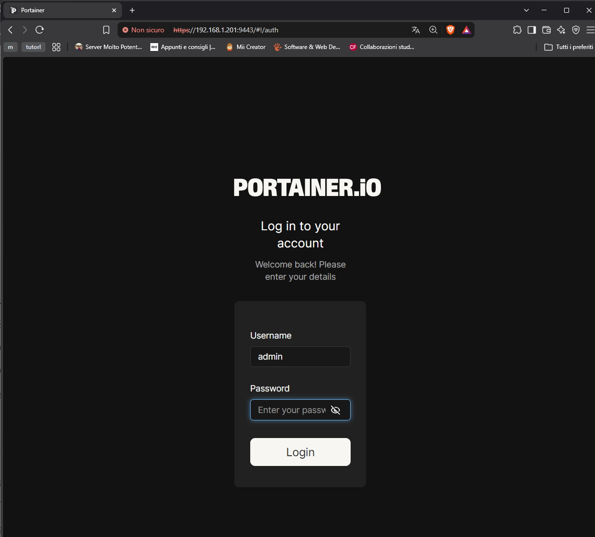

## 3. Deploy dell'Infrastruttura e Gestione
Una volta preparato l'Host, ed i file di configurazion che vengono riportati sotto, l'infrastruttura si avvierà con il seguente comande:
```bash
# Avvio di tutti i container definiti nel Compose
sudo docker compose up -d --build
```
**Tutto il resto dell'installazione è stato delegato ai file sottostanti.**


### 3.1 Il File Immagine: `Dockerfile`

Pur essendo disponibili immagini Docker ufficiali di Samba AD, si è scelto deliberatamente di **non utilizzarne una già predisposta per la realizzazione del domain controller**. Essendo il dominio Active Directory basato su Samba il fulcro del progetto e il principale oggetto di studio, l'utilizzo di un'immagine già configurata avrebbe ridotto significativamente la componente di progettazione e configurazione richiesta. Si è quindi preferito realizzare e configurare autonomamente il container Samba AD, così da comprendere e documentare direttamente tutti i passaggi necessari alla sua implementazione.

Per gli altri container, invece, si è fatto ricorso a immagini ufficiali già disponibili, poiché tali servizi non costituivano l'obiettivo principale del progetto, ma avevano principalmente una funzione **dimostrativa e di integrazione**. Webmail, phpLDAPadmin e mailserver sono stati infatti inclusi per mostrare come il dominio Samba possa integrarsi con servizi e strumenti esterni. Analogamente, Portainer è stato utilizzato per fornire un'interfaccia grafica accessibile dal browser del computer fisico, facilitando la gestione dei container.

In questi casi, l'utilizzo di immagini già pronte ha permesso di concentrare il lavoro sugli aspetti effettivamente rilevanti per il progetto, evitando di dedicare una parte significativa dell'attività alla realizzazione da zero di componenti che non costituivano l'oggetto principale della prova.


Il Dockerfile è il seguente:

```dockerfile
FROM ubuntu:24.04

#Evita che durante l'installazione si aprano finestre
ENV DEBIAN_FRONTEND=noninteractive

#aggiorniamo la repository e installiamo Samba, Kerberos e le dipendenze per l'AD DC
#(Active Directory Domain Controller)
RUN apt-get update && apt-get install -y \
    samba \
    smbclient \
    krb5-user \
    winbind \
    libpam-winbind \
    libnss-winbind \
    acl \
    attr \
    dnsutils \
    dos2unix \
    iproute2 \
    iputils-ping \
    && rm -rf /var/lib/apt/lists/*

#copiamo lo script di entrypoint che farà il provisioning dell'AD
COPY entrypoint.sh /entrypoint.sh
RUN dos2unix /entrypoint.sh && chmod +x /entrypoint.sh

#Espone le porte standard di Active Directory
#53(DNS), 88(Kerberos), 135(RPC), 389/636(LDAP/S), 445(SMB)
EXPOSE 53 53/udp 88 88/udp 135 389 389/udp 445 464 464/udp 636

ENTRYPOINT ["/entrypoint.sh"]
```
Questo file permette di aggiungere i pachetti necessari alla creazione del dominio, espone le porte necessarie, copia il file entrypoint.sh e lo esegue. La variabile di ambiente DEBIAN_FRONTEND=noninteractive serve ad evitare che durante l'installazione si aprano finestre.

### 3.2 Il Provisioning Automatico: `entrypoint.sh`
Questo script bash viene lanciato in automatico appena il container nasce. Il suo scopo è creare il Dominio senza che l'utente debba interagire con i comandi di `samba-tool`.

```bash
#!/bin/bash

#al primo errore esci
set -e

#variabili d'ambiente
REALM="${REALM:-LALILULELO.LOCAL}"
DOMAIN="${DOMAIN:-LALILULELO}"
ADMIN_PASSWORD="${ADMIN_PASSWORD:-datemi30!}"

#workaround per sovrascrivere il DNS nel container anche in "network_mode: host"
# Dato che hai CAP_SYS_ADMIN, possiamo smontare il file resolv.conf bind-mountato da Docker (o dall'host)
umount /etc/resolv.conf 2>/dev/null || true
rm -f /etc/resolv.conf
echo "nameserver 127.0.0.1" > /etc/resolv.conf
echo "search ${REALM}" >> /etc/resolv.conf
echo "-------- File /etc/resolv.conf forzato su 127.0.0.1 -----"

# Controlla se l'AD è già stato configurato in passato
if [ ! -f /var/lib/samba/private/sam.ldb ]; then
    echo "------ Configurazione iniziale di Samba Active Directory DC ----"

    # Rimuove la configurazione Samba di default che bloccherebbe il provisioning
    rm -f /etc/samba/smb.conf

    # Esegue il provisioning ufficiale dell'Active Directory
    # Usa il DNS interno di Samba per semplicità didattica
    samba-tool domain provision \
        --use-rfc2307 \
        --realm="${REALM}" \
        --domain="${DOMAIN}" \
        --server-role=dc \
        --dns-backend=SAMBA_INTERNAL \ 
        --host-name=ad-dc \
        --option="dns forwarder = 8.8.8.8" \
        --adminpass="${ADMIN_PASSWORD}"

    echo "---- Provisioning completato con successo --------"
else
    echo "------ Active Directory già configurato. Avvio in corso... ------"
fi

# Sovrascrive la configurazione di Kerberos per forzare la risoluzione in locale (su 127.0.0.1)
# bypassando il DNS di Docker che non conosce il nostro dominio
cat <<EOF > /etc/krb5.conf
[libdefaults]
    default_realm = ${REALM}
    dns_lookup_realm = false
    dns_lookup_kdc = false

[realms]
${REALM} = {
    kdc = 127.0.0.1
}
EOF

# Avvia Samba in modalità "Active Directory Domain Controller" in primo piano (foreground)
# In questo modo il container Docker rimane attivo e mostra i log
exec samba -F

```
Questo script ha la caratteristica di essere idempotente, quindi se eseguito più volte il risultato rimane il medesimo.
 Risolve un problema noto dell'esecuzione in `network_mode: host`. Se lasciato intatto, il container erediterebbe il DNS dell'host, impedendo al comando `domain provision` di rintracciare se stesso. Con la capability `SYS_ADMIN` dichiarata nel compose, lo script **scollega** (umount) forzatamente il file DNS dell'host per fargli puntare al localhost.

### 3.3 L'Orchestrazione: `docker-compose.yml` 
Il file YAML lega insieme Dominio, Interfaccia grafica (phpldapadmin) e Server di posta (docker-mailserver) e webmail(roundcube).

```yaml
services:
  samba-dc:
    build:
      context: .
      dockerfile: Dockerfile
    container_name: lalilulelo_ad
    network_mode: "host" #serve per esporre le porte in automatico, altrimenti sarebbe stato troppo complicato la canfigurazione. In questo modo viene usata la porta di rete e l'indirizzo della macchina host.
    cap_add:
      - SYS_ADMIN
    environment:
      - REALM=LALILULELO.LOCAL
      - DOMAIN=LALILULELO
      - ADMIN_PASSWORD=datemi30!
    dns:
      - 127.0.0.1
    dns_search:
      - LALILULELO.LOCAL
    volumes:
      # Volumi nominali per salvare i dati di Active Directory e la configurazione
      - samba-etc:/etc/samba
      - samba-var:/var/lib/samba
    restart: unless-stopped
  ldap-ui:
    image: osixia/phpldapadmin:latest
    container_name: samba-ad-webui
    ports:
      - "8080:80"
    environment:
      # Modificato in ldaps:// per soddisfare il requisito "strong authentication"
      - PHPLDAPADMIN_LDAP_HOSTS=ldaps://192.168.1.201 #indirizzo della macchina host
      - PHPLDAPADMIN_HTTPS=false
      - PHPLDAPADMIN_LDAP_CLIENT_TLS=true
      - PHPLDAPADMIN_LDAP_CLIENT_TLS_REQCERT=never
    restart: unless-stopped

  mailserver:
    #docker/mailserver è stato rinominato in mailserver/docker-mailserver
    image: mailserver/docker-mailserver:latest
    container_name: mailserver
    hostname: mail.lalilulelo.local
    domainname: lalilulelo.local
    ports:
      - "25:25"
      - "143:143"
      - "587:587"
      - "993:993"
    volumes:
      - maildata:/var/mail
      - mailstate:/var/mail-state
      - maillogs:/var/log/mail
      - ./config:/tmp/docker-mailserver
      - ./user-patches.sh:/tmp/docker-mailserver/user-patches.sh:ro
      - ./ldap.conf:/etc/ldap/ldap.conf:ro
      - ./dovecot-ldap.conf.ext:/etc/dovecot/dovecot-ldap.conf.ext:ro
      - ./dovecot-ldap-tls.conf:/etc/dovecot/conf.d/99-ldap-tls.conf:ro
      - samba-var:/ad-data:ro
    extra_hosts:
      - "ad-dc.lalilulelo.local:192.168.1.201"
    environment:
      - ENABLE_SPAMASSASSIN=1
      - ENABLE_CLAMAV=1
      - ENABLE_FAIL2BAN=0
      - ENABLE_POSTGREY=0
      #La configurazione di LDAP per Active Directory
      - ACCOUNT_PROVISIONER=LDAP
      - LDAP_SERVER_HOST=ldaps://ad-dc.lalilulelo.local:636
      - LDAP_SEARCH_BASE=CN=Users,DC=lalilulelo,DC=local
      - LDAP_BIND_DN=Administrator@lalilulelo.local
      - LDAP_BIND_PW=datemi30!
      - LDAP_QUERY_FILTER_USER=(sAMAccountName=%u)
      - LDAP_QUERY_FILTER_GROUP=(member=%s)
      - LDAP_QUERY_FILTER_ALIAS=(proxyAddresses=smtp:%s)
      - "DOVECOT_PASS_FILTER=(sAMAccountName=%{user | username})"
      - "DOVECOT_USER_FILTER=(sAMAccountName=%{user | username})"
      - DOVECOT_PASS_ATTRS=userPrincipalName=user
      - DOVECOT_USER_ATTRS==uid=5000,=gid=5000
      - DOVECOT_AUTH_BIND=yes
    restart: unless-stopped

  roundcube:
    image: roundcube/roundcubemail:latest
    container_name: roundcube
    ports:
      - "8081:80"  #la porta 8080 è occupata da phpLDAPadmin
    environment:
      - ROUNDCUBEMAIL_DEFAULT_HOST=mailserver #qua viene usata la rete interna di docker
      - ROUNDCUBEMAIL_SMTP_SERVER=mailserver
    depends_on:
      - mailserver
    restart: unless-stopped

volumes:
  samba-etc:
  samba-var:
  maildata:
  mailstate:
  maillogs:

```
Da notare che nel container del server di posta viene usato il volume `samba.var` in modo che possa leggere il certificato radice ca.pem generato da samba e possa parlarsi in modalità cifrata
Le variabili LDAP permetto di usare le utenze di Active Directory per autenticarsi al server di posta.

`docker compose ps`
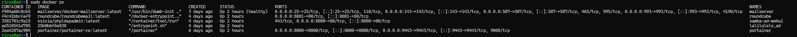

### 3.4 Autenticazione centralizzata: `dovecot-ldap.conf.ext`
Questo file viene caricato nel Mail Server come volume, indica a Dovecot come verificare le credenziali che gli arrivano al momento del login.
```ini
hosts = ldaps://ad-dc.lalilulelo.local:636
ldap_version = 3
auth_bind = yes
auth_bind_userdn = %u
dn = Administrator@lalilulelo.local
dnpass = datemi30!
base = DC=LALILULELO,DC=LOCAL
pass_filter = (sAMAccountName=%n)
user_filter = (sAMAccountName=%n)
tls = no
tls_ca_cert_file = /ad-data/private/tls/ca.pem
tls_require_cert = demand
```
 Questa configurazione evita permette di definire gli account solo su Samba, infatti non è stato necessario creare alcun account in  Dovecot, il  quale cerca la corrispondenza del login (es. `enrico`) controllando l'attributo nativo di Windows/Samba `sAMAccountName` (vedi filtri) stabilendo l'autenticità solo se possiede una connessione LDAPS affidabile con Samba (`tls_require_cert = demand`).

In questo screenshot si vede un login riuscito effettuato tramite l'interfaccia di roundcube: `sudo docker logs mailserver` mostra che l'utente enrico si è loggato correttamente al server di posta con le sue credenziali di Active Directory
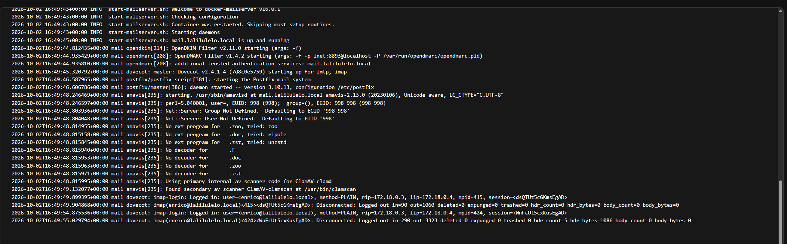


## 4. Join di un client Linux (Xubuntu) al dominio e verifica dell'autenticazione

A completamento del progetto, è stato verificato che il Domain Controller sia in grado di autenticare correttamente un client Linux esterno, distinto dalle macchine Docker utilizzate per la creazione del dominio. A tale scopo è stata utilizzata una VM Xubuntu 26.04 LTS, unita al dominio `lalilulelo.local` (realm `LALILULELO.LOCAL`) tramite lo stack `realmd`/`sssd`, e sono stati eseguiti test di login reali con un utente di dominio (`enrico`).

### Preparazione ambiente e accesso remoto

Per operare più comodamente, è stato abilitato l'accesso SSH alla VM:

```sh
sudo apt update
sudo apt install openssh-server
sudo systemctl start ssh
```

Sono stati quindi installati i pacchetti necessari per l'integrazione con Active Directory:

```sh
sudo apt install realmd sssd sssd-tools libnss-sss libpam-sss adcli samba-common-bin oddjob oddjob-mkhomedir packagekit
```
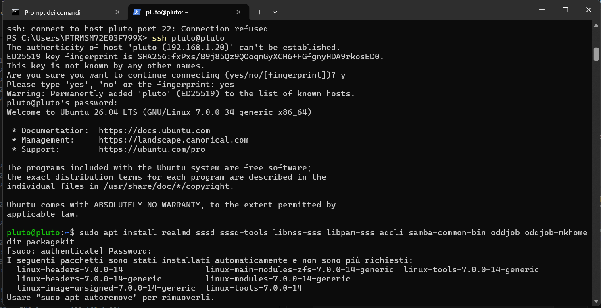

### Configurazione del DNS verso il Domain Controller

Il client risultava inizialmente configurato con il DNS del router (`192.168.1.1`) e nessun dominio di ricerca impostato, impedendo la risoluzione dei record SRV necessari alla scoperta del DC. La configurazione è stata corretta e resa **permanente** tramite NetworkManager, per evitare che venisse sovrascritta al riavvio o al rinnovo del lease DHCP:

```sh
sudo nmcli con mod "netplan-enp0s3" ipv4.dns "192.168.1.201"
sudo nmcli con mod "netplan-enp0s3" ipv4.dns-search "lalilulelo.local"
sudo nmcli con mod "netplan-enp0s3" ipv4.ignore-auto-dns yes
sudo nmcli con up "netplan-enp0s3"
```

La verifica con `resolvectl status` conferma la configurazione corretta e stabile:

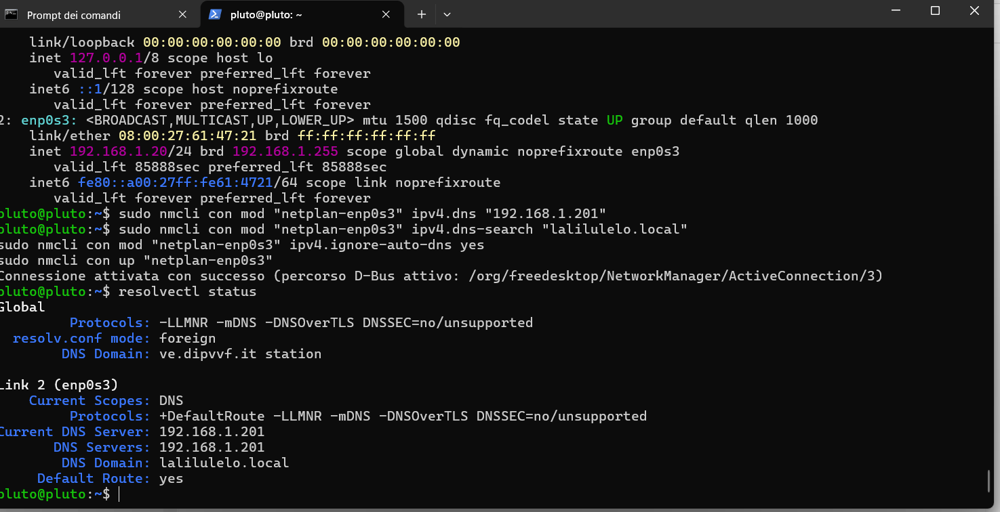

Il corretto funzionamento del DNS del DC è stato inoltre confermato dall'interrogazione dei record SRV di Active Directory:

```sh
  host -t SRV _ldap._tcp.lalilulelo.local
  nslookup -type=SRV _ldap._tcp.lalilulelo.local
```
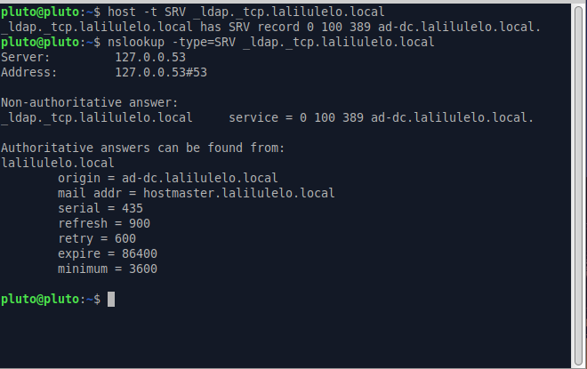

### Verifica isolata dell'autenticazione Kerberos

Prima di procedere al join, è stato verificato che il DC rilasci correttamente i ticket Kerberos per l'utente di dominio:

```sh
sudo apt install krb5-user -y
#inserisci LALILULELO.LOCAL come realm, il resto 'ad-dc' e 'ad-dc'
```
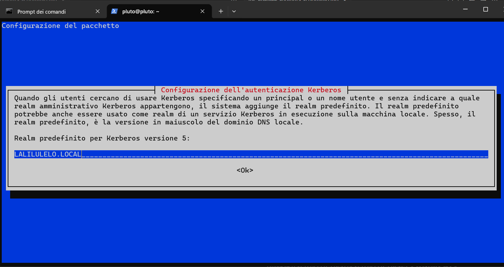
```
kinit enrico@LALILULELO.LOCAL
klist
```

Il comando ha restituito un Ticket Granting Ticket valido (`krbtgt/LALILULELO.LOCAL@LALILULELO.LOCAL`), a conferma che il servizio Kerberos del DC autentica correttamente le credenziali.

### Discovery e join al dominio

```sh
sudo realm discover lalilulelo.local
sudo realm join lalilulelo.local -U enrico
```


Il comando `realm join` ha configurato automaticamente `sssd` (file `/etc/sssd/sssd.conf`), completando il join senza necessità di configurazione manuale di Samba/Kerberos.

Lo stato del join è stato verificato con:

```sh
realm list
```
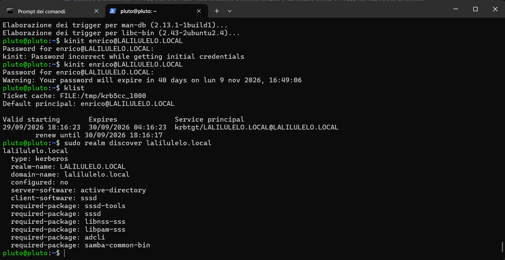
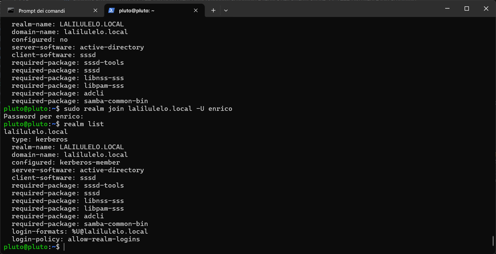

che conferma il dominio come correttamente configurato (`configured: kerberos-member`), con `sssd` come client software e `login-policy: allow-realm-logins`.

### Verifica del login e dell'identità utente

Dopo aver abilitato la creazione automatica della home directory (`pam_oddjob_mkhomedir.so` in `/etc/pam.d/common-session`), sono stati effettuati con successo test di login con l'utente di dominio, sia localmente:

```sh
sudo sed -i '/pam_unix.so/a session optional pam_oddjob_mkhomedir.so umask=0077' /etc/pam.d/common-session
sudo systemctl enable --now oddjobd
su - enrico@lalilulelo.local
```

sia via SSH, sia in locale sulla VM sia da un client Windows remoto sulla stessa rete, confermando l'autenticazione anche in un contesto di accesso realmente distribuito.

Infine, è stata verificata l'identità mappata dal DC per l'utente tramite:

```sh
id enrico@lalilulelo.local
```


```
uid=1222401103(enrico@lalilulelo.local)
gid=1222400513(domain users@lalilulelo.local)
groups=1222400513(domain users@lalilulelo.local),
       1222400512(domain admins@lalilulelo.local),
       1222400572(denied rodc password replication group@lalilulelo.local)
```

Il risultato conferma che il sistema riceve dal DC un'identità completa e coerente con quella definita in Active Directory, inclusa l'appartenenza dell'utente `enrico` al gruppo **Domain Admins**.

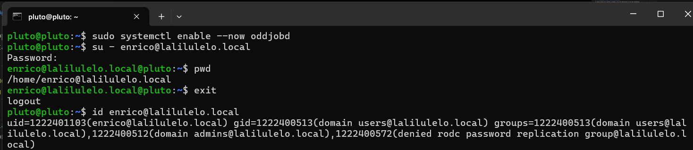

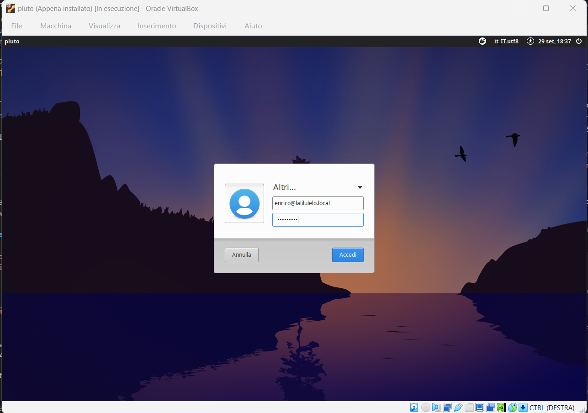

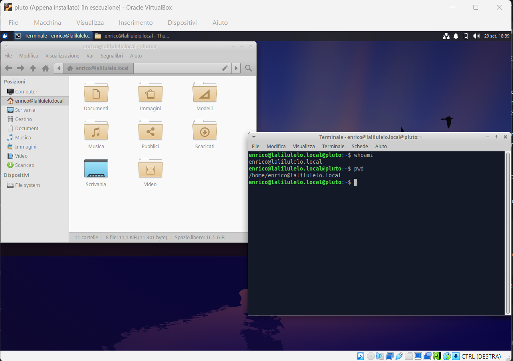


## 5. Amministrazione Dominio
Per l'amministrazione del dominio è possibile usare dei comandi al terminale come quelli qui sotto, o anche  installare strumenti visuali come PHPLDAPADMIN

### Gestione Utenti e Gruppi in AD (`samba-tool`)
Eseguire dal terminale Host:

- **Creazione Utente**:
  ```bash
  docker exec -it lalilulelo_ad samba-tool user create enrico Password123!
  ```
- **Aggiunta utente al gruppo Amministratori**:
  ```bash
  docker exec -it lalilulelo_ad samba-tool group addmembers "Domain Admins" enrico
  ```
- **Reset Password**:
  ```bash
  docker exec -it lalilulelo_ad samba-tool user setpassword enrico --newpassword=1234567-A
  ```
- **Elenco e disattivazione utenti**:
  ```bash
  docker exec -it lalilulelo_ad samba-tool user list
  docker exec lalilulelo_ad samba-tool user disable enrico
  ```

In questo progetto sono stati usati entrambe le modalità di gestione del dominio: da riga di comando e tramite PHPLDAPADMIN.

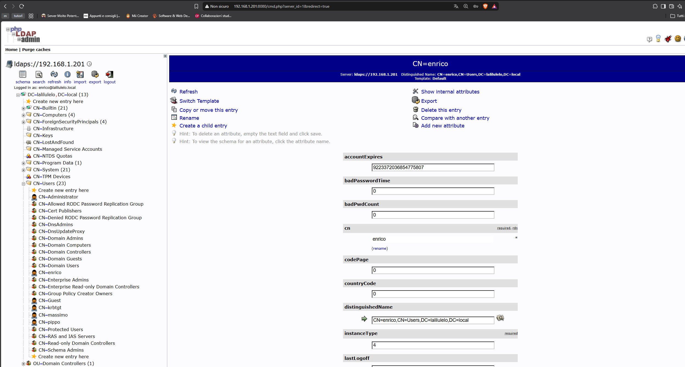

## 6. Posta Elettronica

La posta elettronica può essere raggiunta sia con la webmail inclusa in questo progetto (Roundcube), sia con un MUA come Thunderbird. Entrambi sono configurati per utilizzare il protocollo IMAP per la ricezione e SMTP per l'invio.

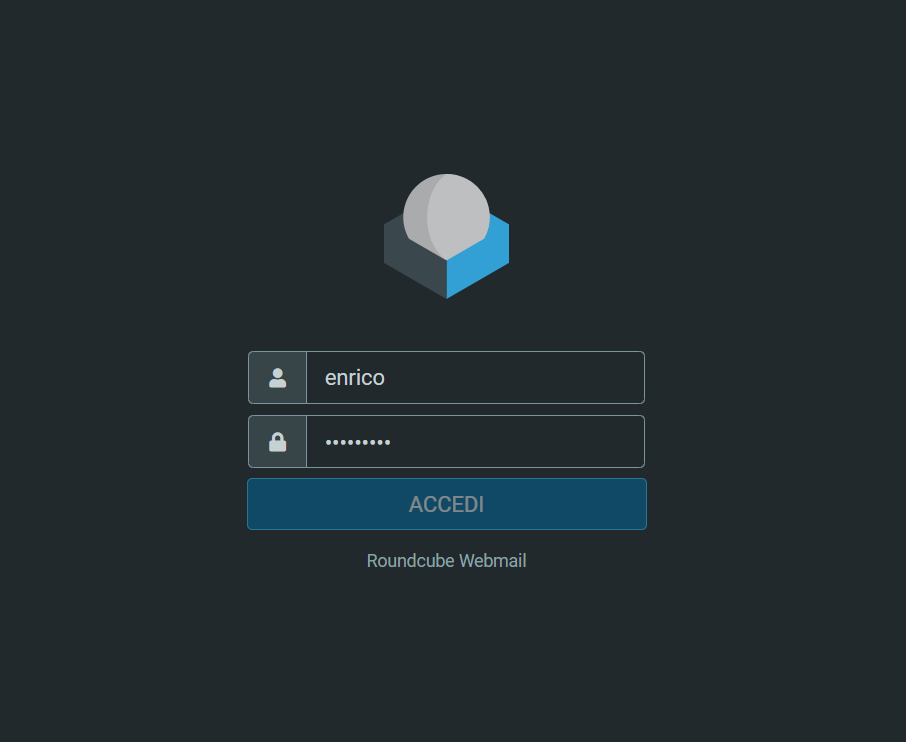

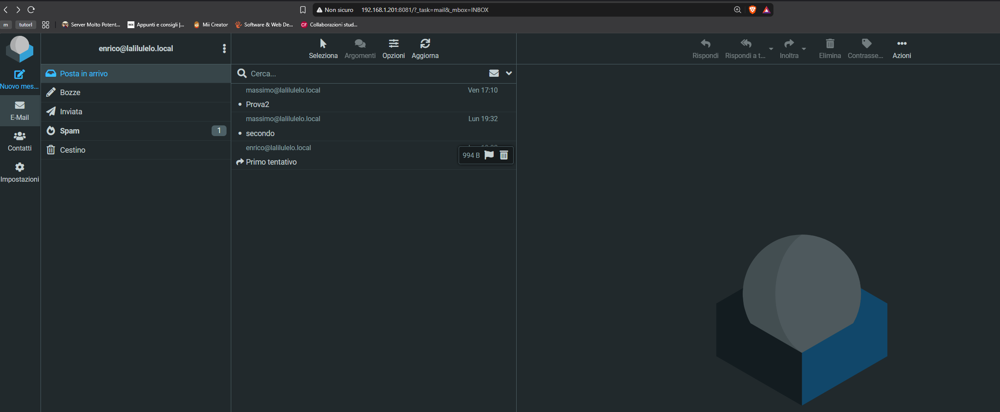

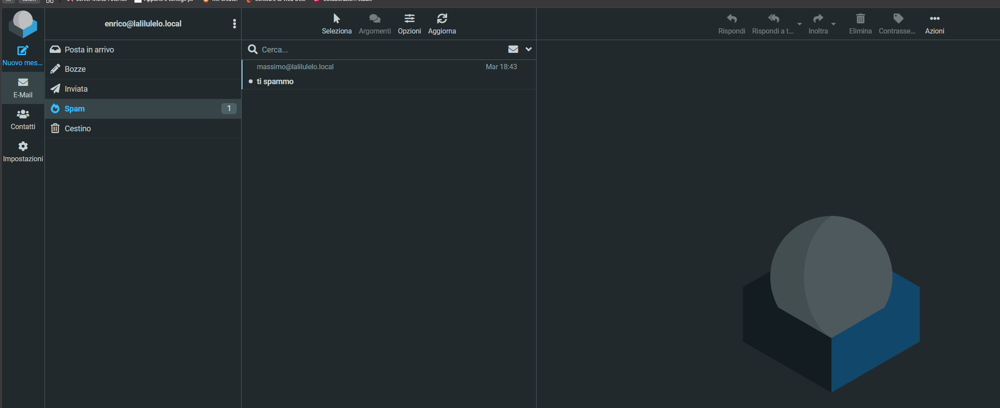

la mail di spam è creato inserendo la stringa sotto riportata (risolto da smapassasin)
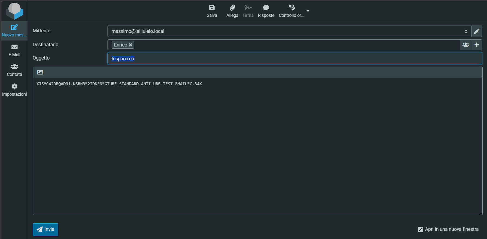


Lo stesso approccio è stato usato per testare l'antivirus ClamAV inviando una mail contenente il virus EICAR.

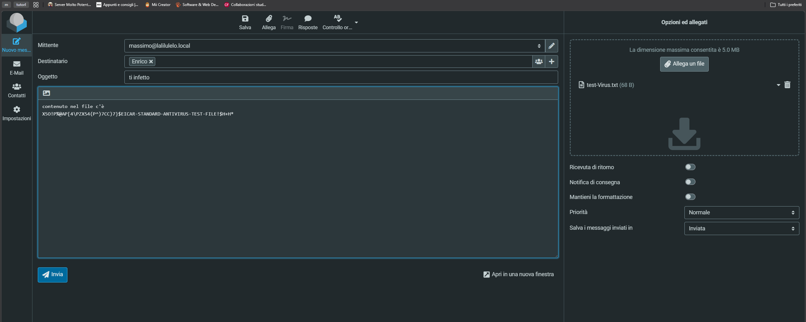

in questo caso la mail è stata bloccata da ClamAV, come si può vedere dall'immagine sotto  ricavata dai log

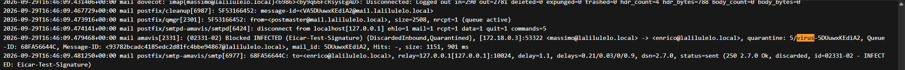
### Configurazione MUA Thunderbird
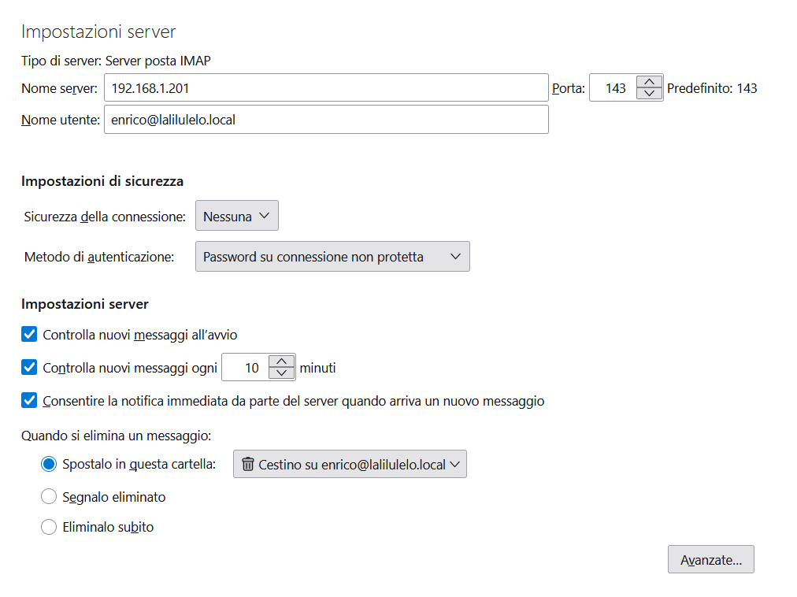

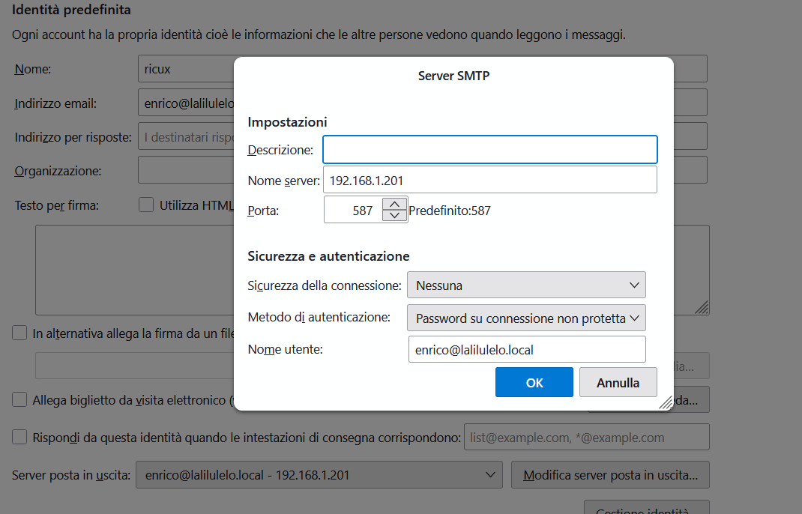

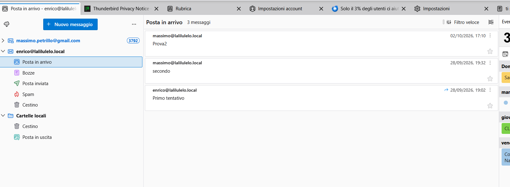


## 15. Conclusione

